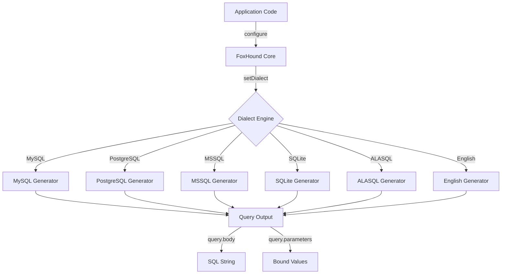
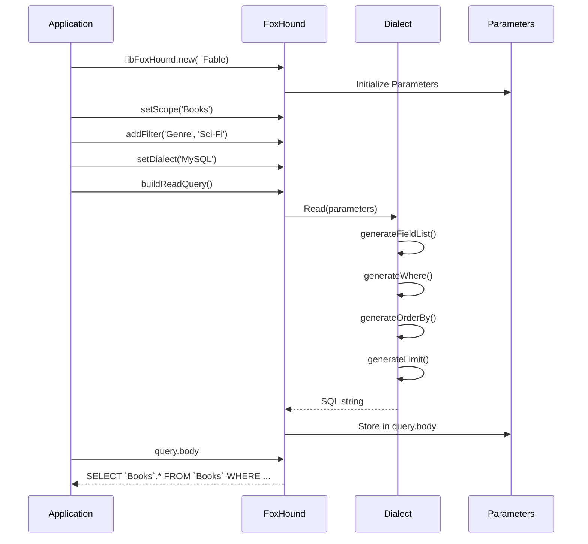
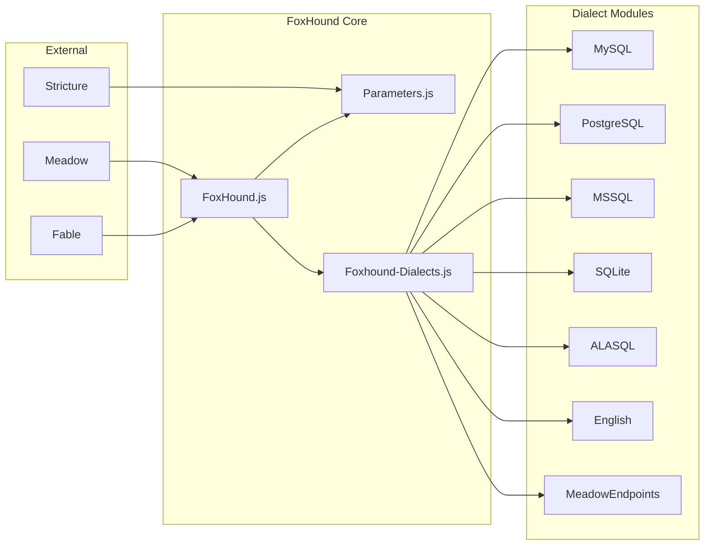
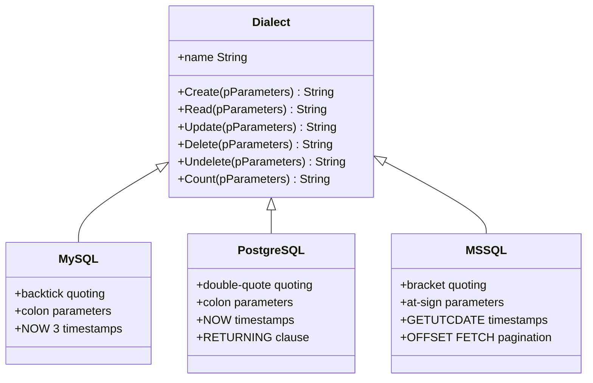
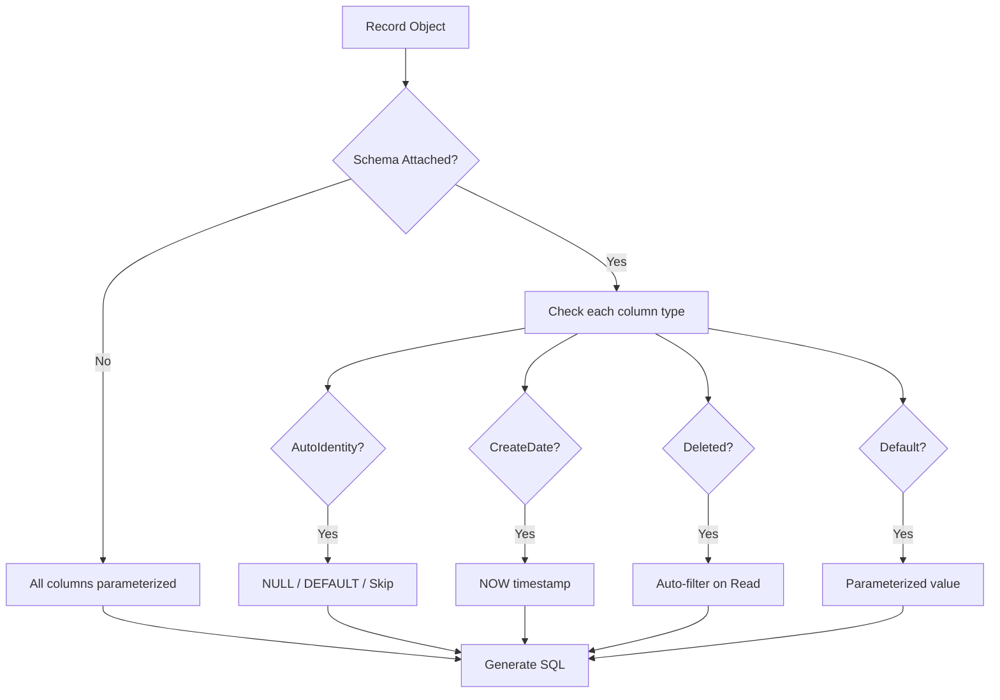

# Architecture

FoxHound follows a clean separation between query configuration, dialect-specific generation, and result handling.

## Overview



## Query Lifecycle



## Component Architecture



## Factory Pattern

FoxHound uses a factory constructor pattern.  The module exports a bare constructor; you create instances by calling `.new()` with a Fable service context:

```javascript
var libFoxHound = require('foxhound');
var tmpQuery = libFoxHound.new(_Fable);
```

Every query instance gets its own UUID and independent parameter state, so multiple queries can be built concurrently without interference.

## Parameters Object

All query state lives in a single `Parameters` object:

| Property | Type | Purpose |
|----------|------|---------|
| `scope` | String | Table or collection name |
| `dataElements` | Array | Column/field list |
| `begin` | Integer | Pagination start offset |
| `cap` | Integer | Maximum rows to return |
| `filter` | Array | Filter expression objects |
| `sort` | Array | Sort expression objects |
| `join` | Array | Join expression objects |
| `query` | Object | Generated query body, schema, records, and bound parameters |
| `queryOverride` | String | Custom query template |
| `indexHints` | Array | Index hints for the database engine |
| `userID` | Integer | The acting user (for audit stamps) |
| `result` | Object | Execution results (value, error, executed flag) |

## Dialect Strategy

Each dialect is a module that exports a factory function accepting a Fable instance.  The returned object exposes six methods that each accept a Parameters object and return a SQL string:



The dialect handles all syntax differences: quoting identifiers, parameter prefixes, pagination syntax, date functions, and identity column handling.

## Chainable API

Every setter method returns `this`, enabling fluent composition:

```javascript
tmpQuery
	.setScope('Orders')
	.setDataElements(['OrderID', 'Total', 'Status'])
	.addFilter('Status', 'Pending')
	.addSort({Column: 'Total', Direction: 'Descending'})
	.setCap(50)
	.setDialect('MySQL')
	.buildReadQuery();
```

## Fable Integration

FoxHound depends on Fable for:

- **UUID Generation** -- each query and record gets a unique identifier via `_Fable.getUUID()`
- **Logging** -- filter, scope, and query errors are logged through `_Fable.log`
- **Utility Functions** -- `_Fable.Utility.extend()` for parameter merging and `_Fable.Utility.template()` for query overrides
- **Configuration** -- inherits any relevant settings from the Fable config

## Schema-Aware Generation


